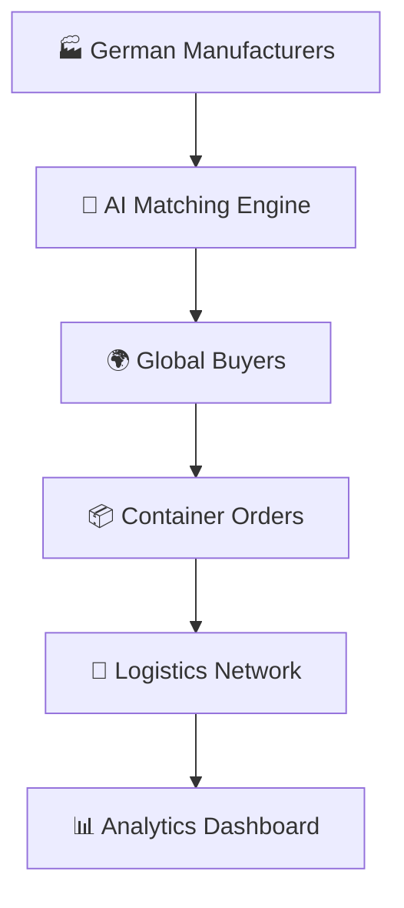
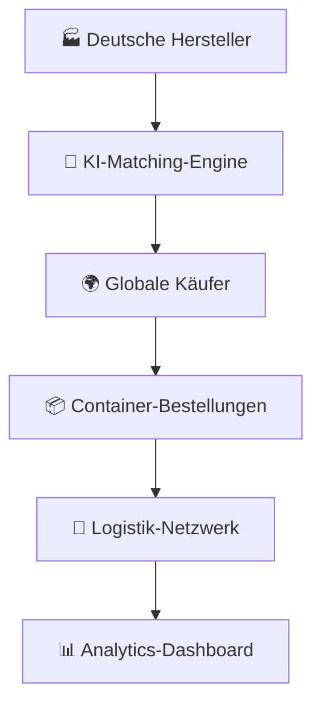

# 🇩🇪 Made in Germany | Digital Industrial Excellence 2025+ 

<div align="center">

```ascii
███╗   ███╗ █████╗ ██████╗ ███████╗    ██╗███╗   ██╗     ██████╗ ███████╗██████╗ ███╗   ███╗ █████╗ ███╗   ██╗██╗   ██╗
████╗ ████║██╔══██╗██╔══██╗██╔════╝    ██║████╗  ██║    ██╔════╝ ██╔════╝██╔══██╗████╗ ████║██╔══██╗████╗  ██║╚██╗ ██╔╝
██╔████╔██║███████║██║  ██║█████╗      ██║██╔██╗ ██║    ██║  ███╗█████╗  ██████╔╝██╔████╔██║███████║██╔██╗ ██║ ╚████╔╝ 
██║╚██╔╝██║██╔══██║██║  ██║██╔══╝      ██║██║╚██╗██║    ██║   ██║██╔══╝  ██╔══██╗██║╚██╔╝██║██╔══██║██║╚██╗██║  ╚██╔╝  
██║ ╚═╝ ██║██║  ██║██████╔╝███████╗    ██║██║ ╚████║    ╚██████╔╝███████╗██║  ██║██║ ╚═╝ ██║██║  ██║██║ ╚████║   ██║   
╚═╝     ╚═╝╚═╝  ╚═╝╚═════╝ ╚══════╝    ╚═╝╚═╝  ╚═══╝     ╚═════╝ ╚══════╝╚═╝  ╚═╝╚═╝     ╚═╝╚═╝  ╚═╝╚═╝  ╚═══╝   ╚═╝   
```

[](https://made-in-germany.de)
[]()
[]()
[]()

**🎯 Connecting German Industrial Excellence with Global Markets**

</div>

---

## 🌟 Vision 2030: The Future of B2B Industrial Commerce

**Made in Germany** revolutionizes international B2B commerce by creating a digital ecosystem where German industrial excellence meets global demand. Our quantum-leap platform transforms traditional manufacturing partnerships into intelligent, automated business relationships.

### 🚀 Founded by Visionary | Andreas Thommen
*Digital Pioneer & Platform Architect*

---

## 🔮 Core Technology Stack

### 🌐 **Hyper-Connected Marketplace**


### ⚡ **Platform Capabilities**

| Feature | Technology | Impact |
|---------|------------|--------|
| 🔄 **Smart Integration** | XML/CSV Auto-Upload | Real-time catalog sync |
| 📦 **Container Ordering** | One-Click Procurement | Direct manufacturer connection |
| 🌍 **Global Logistics** | Centralized Hub Control | Seamless distribution |
| 🤝 **Franchise Network** | 50+ Country Partners | Local market expertise |
| 🧠 **AI-Powered CRM** | Automated Lead Funnels | Intelligent sales automation |
| 🎯 **SEO Optimization** | Country-Specific Domains | Maximum market penetration |

---

## 🏭 Industry Verticals | German Engineering Excellence

<details>
<summary>🔧 <strong>Maschinenbau & Industrieanlagen</strong></summary>

Revolutionary manufacturing equipment and industrial systems that define global standards for precision and reliability.
</details>

<details>
<summary>🏥 <strong>Medizintechnik & Laborausstattung</strong></summary>

Cutting-edge medical technology and laboratory equipment advancing healthcare worldwide.
</details>

<details>
<summary>🍽️ <strong>Gastronomie- & Hotelbedarf</strong></summary>

Premium hospitality solutions that elevate service standards across international markets.
</details>

<details>
<summary>🚗 <strong>Automobilzulieferung</strong></summary>

Automotive components and systems driving the future of mobility and electric vehicles.
</details>

<details>
<summary>🧪 <strong>Chemie & Pharma</strong></summary>

Advanced chemical and pharmaceutical solutions powering innovation across industries.
</details>

---

## 🌟 Platform Architecture | Next-Gen Features

```yaml
🔹 Digital Transformation:
  - Automated procurement workflows
  - Real-time inventory synchronization
  - Predictive demand analytics
  - Blockchain-verified transactions

🔹 Global Scalability:
  - Multi-language CRM system
  - Regional compliance automation
  - Currency hedging integration
  - Time-zone optimized operations

🔹 Intelligence Layer:
  - Machine learning buyer matching
  - Automated quality scoring
  - Predictive logistics planning
  - Dynamic pricing optimization
```

---

## 🚀 Getting Started | Join the Revolution

### For Manufacturers 🏭
1. **Connect** → Upload your product catalog via XML/CSV
2. **Integrate** → Sync with our intelligent platform
3. **Scale** → Reach global markets instantly

### For Buyers 🌍  
1. **Discover** → Browse premium German products
2. **Order** → Container-scale procurement in one click
3. **Receive** → Seamless logistics to your location

### For Partners 🤝
1. **Apply** → Join our global franchise network
2. **Launch** → Establish local market presence  
3. **Grow** → Scale with our proven system

---

## 📞 Connect with the Future

<div align="center">

🌐 **Platform:** [made-in-germany.de](https://made-in-germany.de)

📧 **Contact:** kontakt@made-in-germany.de

🔮 **Industry 4.0 Ready** | **AI-Powered** | **Global Scale**

</div>

---

# 🇩🇪 Made in Germany | Digitale Industrielle Exzellenz 2025+

<div align="center">

**🎯 Deutsche Industrielle Exzellenz mit Globalen Märkten Verbinden**

</div>

---

## 🌟 Vision 2030: Die Zukunft des B2B-Industriehandels

**Made in Germany** revolutioniert den internationalen B2B-Handel durch ein digitales Ökosystem, in dem deutsche industrielle Exzellenz auf globale Nachfrage trifft. Unsere Quantensprung-Plattform verwandelt traditionelle Fertigungspartnerschaften in intelligente, automatisierte Geschäftsbeziehungen.

### 🚀 Gegründet von Visionär | Andreas Thommen
*Digital-Pionier & Plattform-Architekt*

---

## 🔮 Kern-Technologie-Stack

### 🌐 **Hyper-Vernetzter Marktplatz**


### ⚡ **Plattform-Fähigkeiten**

| Feature | Technologie | Impact |
|---------|-------------|---------|
| 🔄 **Smart Integration** | XML/CSV Auto-Upload | Echtzeit-Katalog-Sync |
| 📦 **Container-Bestellung** | Ein-Klick-Beschaffung | Direkte Herstellerverbindung |
| 🌍 **Globale Logistik** | Zentrale Hub-Kontrolle | Nahtlose Distribution |
| 🤝 **Franchise-Netzwerk** | 50+ Länder-Partner | Lokale Marktexpertise |
| 🧠 **KI-gestütztes CRM** | Automatisierte Lead-Funnel | Intelligente Vertriebsautomation |
| 🎯 **SEO-Optimierung** | Länderspezifische Domains | Maximale Marktpenetration |

---

## 🏭 Industriezweige | Deutsche Ingenieurskunst

<details>
<summary>🔧 <strong>Maschinenbau & Industrieanlagen</strong></summary>

Revolutionäre Fertigungsausrüstung und Industriesysteme, die globale Standards für Präzision und Zuverlässigkeit definieren.
</details>

<details>
<summary>🏥 <strong>Medizintechnik & Laborausstattung</strong></summary>

Modernste Medizintechnik und Laborausrüstung, die das Gesundheitswesen weltweit vorantreibt.
</details>

<details>
<summary>🍽️ <strong>Gastronomie- & Hotelbedarf</strong></summary>

Premium-Hospitality-Lösungen, die Servicestandards in internationalen Märkten erhöhen.
</details>

<details>
<summary>🚗 <strong>Automobilzulieferung</strong></summary>

Automotive-Komponenten und -Systeme, die die Zukunft der Mobilität und Elektrofahrzeuge antreiben.
</details>

<details>
<summary>🧪 <strong>Chemie & Pharma</strong></summary>

Fortschrittliche chemische und pharmazeutische Lösungen, die Innovation branchenübergreifend antreiben.
</details>

---

## 🌟 Plattform-Architektur | Next-Gen Features

```yaml
🔹 Digitale Transformation:
  - Automatisierte Beschaffungsworkflows
  - Echtzeit-Inventar-Synchronisation
  - Predictive Demand Analytics
  - Blockchain-verifizierte Transaktionen

🔹 Globale Skalierbarkeit:
  - Mehrsprachiges CRM-System
  - Regionale Compliance-Automatisierung
  - Währungsabsicherungs-Integration
  - Zeitzonenoptimierte Operationen

🔹 Intelligence Layer:
  - Machine Learning Käufer-Matching
  - Automatisierte Qualitätsbewertung
  - Predictive Logistikplanung
  - Dynamische Preisoptimierung
```

---

## 🚀 Erste Schritte | Werden Sie Teil der Revolution

### Für Hersteller 🏭
1. **Verbinden** → Laden Sie Ihren Produktkatalog via XML/CSV hoch
2. **Integrieren** → Synchronisieren Sie mit unserer intelligenten Plattform
3. **Skalieren** → Erreichen Sie sofort globale Märkte

### Für Käufer 🌍  
1. **Entdecken** → Durchsuchen Sie Premium-deutsche Produkte
2. **Bestellen** → Container-skalige Beschaffung mit einem Klick
3. **Erhalten** → Nahtlose Logistik zu Ihrem Standort

### Für Partner 🤝
1. **Bewerben** → Treten Sie unserem globalen Franchise-Netzwerk bei
2. **Starten** → Etablieren Sie lokale Marktpräsenz  
3. **Wachsen** → Skalieren Sie mit unserem bewährten System

---

## 📞 Verbinden Sie sich mit der Zukunft

<div align="center">

🌐 **Plattform:** [made-in-germany.de](https://made-in-germany.de)

📧 **Kontakt:** kontakt@made-in-germany.de

🔮 **Industrie 4.0 Ready** | **KI-gestützt** | **Globaler Maßstab**

</div>

---

<div align="center">

**🌟 Powered by German Engineering Excellence | Angetrieben von Deutscher Ingenieurskunst 🌟**

*Transforming Global B2B Commerce Since 2025 | Transformation des Globalen B2B-Handels Seit 2025*

</div>
